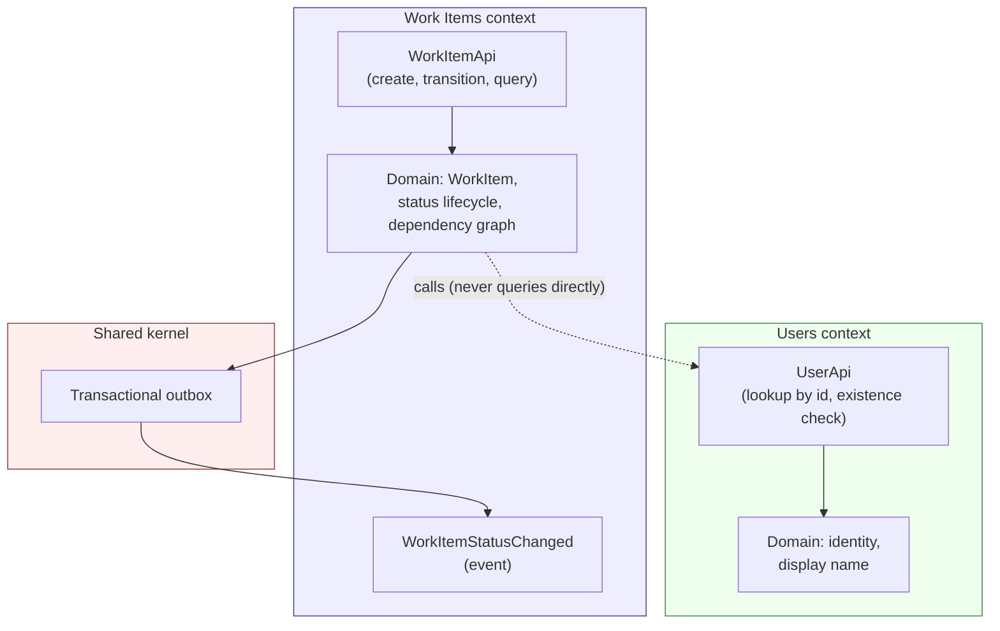

# Work Item Service

A task management service. The domain is deliberately ordinary; the engineering is the point.

## What it does

- Create work items and move them through a defined status lifecycle
- Declare dependencies between work items
- Answer "what can I start right now?" — a topological ordering over the dependency graph
- Publish domain events reliably via a transactional outbox

## What it explicitly does not do

Scope was fixed before implementation began and did not move. See [`docs/not-doing.md`](docs/not-doing.md)
for the full list and the reasoning behind each cut.

## Architecture

Modular monolith. One Gradle module per bounded context. Modules may only reference each other's
published API packages — this boundary is enforced by ArchUnit tests that fail the build, not by
convention.



Each context inside is layered hexagonally (domain → application → adapters), so the domain model
has no dependency on Spring, JPA, or HTTP.

| Context | Owns | Publishes | Must never know |
|---|---|---|---|
| **Work Items** | Work items, their status lifecycle, dependencies between them | `WorkItemApi` (create, transition, query), `WorkItemStatusChanged` event | How users are authenticated or stored |
| **Users** | User identity and display name | `UserApi` (lookup by id, existence check) | That work items exist at all |

## Design decisions

Architectural choices are recorded as ADRs, including what was given up and not just what was
chosen. See [`docs/adr/`](docs/adr/).

## Running it

```bash
docker compose up
```

## Tech stack

Java 21 (LTS) · Spring Boot 3.x · Gradle (Kotlin DSL) · PostgreSQL · Flyway · Testcontainers

## Scope

Fixed before the first line of code, deliberately narrow, and did not move for the duration of the
project. What was left out, and why, is in [`docs/not-doing.md`](docs/not-doing.md).
