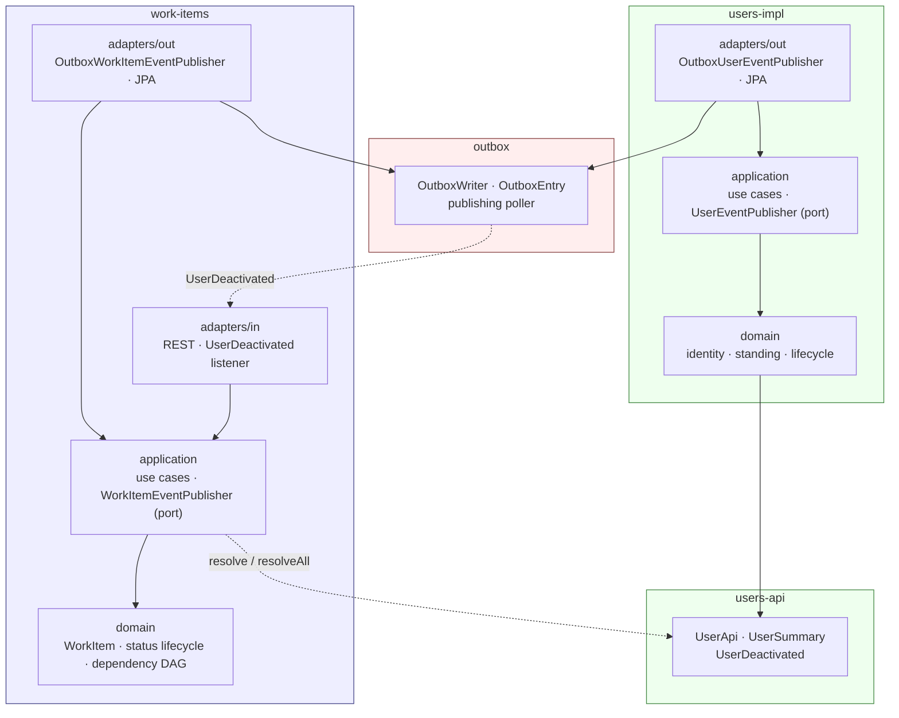

# Work Item Service

A task management service. The domain is deliberately ordinary; the engineering is the point.

## What it does

- Create work items and move them through a defined status lifecycle
- Declare dependencies between work items, with cycles rejected on write
- Answer "what can I start right now?" and "in what order should all of this be done?" — a
  topological ordering over the dependency graph
- Publish domain events reliably via a transactional outbox

## What it explicitly does not do

Scope was fixed before implementation began and did not move. See [`docs/not-doing.md`](docs/not-doing.md)
for the full list and the reasoning behind each cut.

## Architecture

Modular monolith. One Gradle module per bounded context. Modules may only reference each other's
published API packages — this boundary is enforced by ArchUnit tests that fail the build, not by
convention.

### Modules

| Module | Holds |
|---|---|
| `work-items` | The Work Items context, layered hexagonally |
| `users-api` | The Users context's published contract — interfaces, `UserSummary`, `UserDeactivated` |
| `users-impl` | The Users context's domain, application and adapters |
| `outbox` | The transactional outbox: `OutboxWriter`, `OutboxEntry`, the publishing poller |
| `app` | The single deployable. Wires implementations to ports; the only module that knows the whole graph |

**There is no shared kernel.** One was specified in ADR-0001 and removed in
[ADR-0007](docs/adr/0007-no-shared-kernel.md): nothing turned out to belong in it. The contexts
integrate through `users-api` — a published contract with a single owner — which is a stricter
relationship than a jointly owned module.



Arrows point in the direction of dependency. Two things are worth reading off the diagram: no arrow
leaves a `domain` box, and no arrow reaches the `outbox` module from anywhere but `adapters/out`.

The dependency between contexts runs in **one direction only**: Work Items depends on `users-api`;
Users depends on nothing. The graph of contexts is acyclic, which is what keeps Users independently
buildable and testable and leaves the extraction path open.

### Rules that apply to every context

Stated once here rather than repeated per context, and enforced by ArchUnit rather than by review:

- The `domain` layer depends on no framework — no Spring, no JPA, no Jakarta, no HTTP types
- The `domain` layer depends on no infrastructure either. Domain events are **returned**, never
  published from inside an aggregate; the application layer writes them to the outbox in the same
  transaction as the state change
- Only `adapters/out` may reference the `outbox` module. Nothing in `domain` or `application` may
- A context may reference another only through its published `api` module, never its `impl`
- No ambient caller identity: the acting `UserId` is passed as an explicit parameter. Nothing in the
  domain or application layers reads a security context

Each context is layered hexagonally: domain → application → adapters.

### Dependency graph convention

**`A ──▶ B` means "A must finish before B."** The arrow points in the direction work flows, so
in-degree is the number of things blocking an item. Acyclicity is enforced when an edge is added,
which is what makes the ordering operation total at read time.

## Bounded contexts

```
Context:            Work Items

Owns:               WorkItem identity (id, displayName, description, assignee, createdBy)
                    WorkItem status (NEW, IN_TRIAGE, ACTIVE, FOR_REVIEW, FINISHED)
                      and the permitted transitions between them
                    Dependency edges between work items, and the acyclicity of that graph
                    The answer to "what is startable right now?" and "in what order?"

Publishes:          WorkItemSummary { id, displayName, status, assignee }

                    WorkItemSummary       resolve(WorkItemId id);
                    List<WorkItemSummary> findByAssignee(UserId assignee);
                    List<WorkItemSummary> startable();
                    List<WorkItemSummary> plan();
                    int                   activeCountFor(UserId assignee);

                    event WorkItemStatusChanged { workItemId, from, to, occurredAt }

Must never know:    How users are authenticated, or how user records are stored
                      — depends on users-api only, never users-impl
                    Any user attribute beyond what UserSummary carries
                    How a user comes to be deactivated
                      — it reacts to UserDeactivated; it never drives user lifecycle
                    Who the calling user is, ambiently

Invariants:         ID is permanent and always resolves
                    Display name non-blank
                    Description non-blank
                    Status transitions follow the defined lifecycle; invalid
                      transitions are rejected in the domain
                    Adding a dependency edge that would close a cycle is rejected
                      (a self-dependency is the degenerate case)
                    A work item cannot become ACTIVE while any prerequisite is unfinished
                    A work item cannot be assigned to a DEACTIVATED user
                    Only ADMIN may transition a work item to FINISHED
                    Only ADMIN may create a work item
```

```
Context:            Users

Owns:               User identity (id, email, displayName)
                    User standing (role: MEMBER, ADMIN)
                    User lifecycle (ACTIVE, DEACTIVATED)
                    User record creation (admin-provisioned; no self-registration)

Publishes:          UserSummary { id, displayName, role, active }

                    UserSummary              resolve(UserId id);
                    Map<UserId, UserSummary> resolveAll(Set<UserId> ids);

                    event UserDeactivated { userId, occurredAt }

Must never know:    That work items exist
                    Whether a user may act on a work item
                    What anyone is assigned to

Invariants:         An issued UserId is permanent and always resolves; there is no hard delete
                    Email is globally unique and permanent; a deactivated user's address
                      is never released for reuse
                    The last remaining ADMIN cannot be deactivated
                    Deactivation is idempotent; reactivation restores the existing record
                    Display name non-blank
```

Assignment is validated against a user's status at the time it is made. A user deactivated
afterwards is handled by the `UserDeactivated` listener in Work Items, which unassigns their open
items — the two halves of one rule, one synchronous and one eventual.

## Design decisions

Architectural choices are recorded as ADRs, including what was given up and not just what was
chosen. See [`docs/adr/`](docs/adr/).

## Running it

```bash
docker compose up
```

## Tech stack

Java 21 (LTS) · Spring Boot 3.x · Gradle (Kotlin DSL) · PostgreSQL · Flyway · Testcontainers

## Scope

Fixed before the first line of code, deliberately narrow, and did not move for the duration of the
project. What was left out, and why, is in [`docs/not-doing.md`](docs/not-doing.md).
